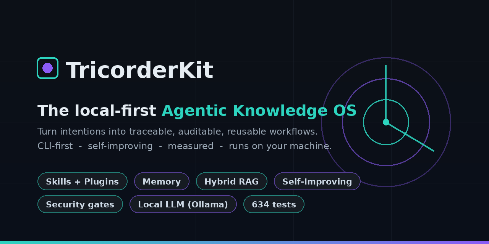
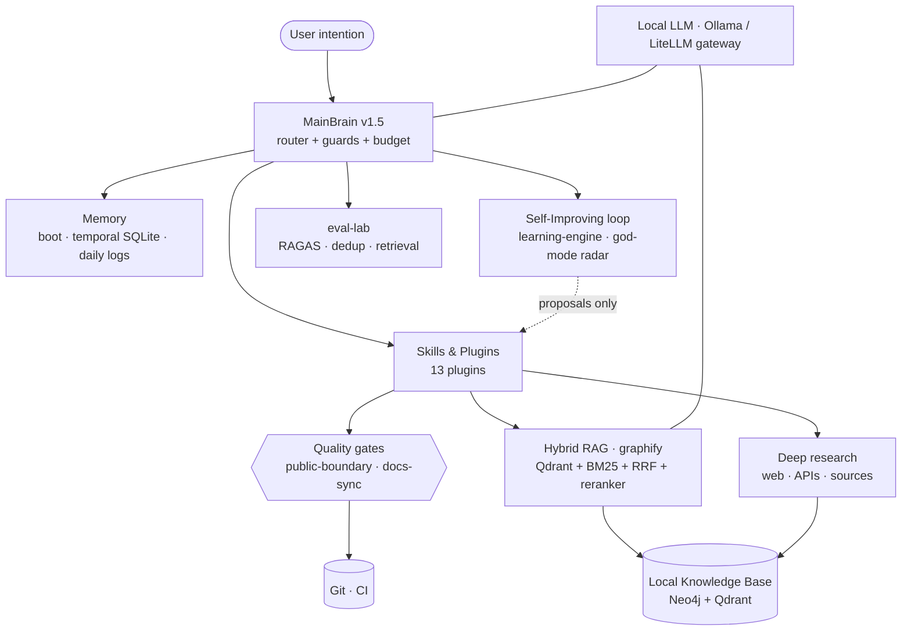

<div align="center">



# TricorderKit

**The local-first Agentic Knowledge OS** — turn intentions into traceable, auditable, reusable workflows.
CLI-first · self-improving · measured · runs on your own machine.

[](CHANGELOG.md)
[](.planning/STATE.md)
[](STATUS.md)
[](docker-compose.yml)
[](LICENSE)

[Quick start](#-quick-start) • [Guardrails](#-governance--guardrails) • [Architecture](#-architecture) • [Measured results](#-measured-results) • [What's inside](#-whats-inside) • [FAQ](#-faq)

</div>

---

## Why TricorderKit?

Most agent setups are a pile of prompts and scripts that nobody can audit, reproduce, or improve. TricorderKit treats an agent like an **operating system for knowledge work**: every intention becomes a workflow that is **traceable, testable, and reusable** — and the system **measures and improves itself** over time.

|  | Ad-hoc agent setup | **TricorderKit** |
|---|---|---|
| **Where it runs** | Cloud, your data leaves the machine | **Local-first** — Ollama, Neo4j, Qdrant on your box |
| **Claims** | "It works on my prompt" | **Measured** — offline benchmarks + 634 tests |
| **Quality** | Hope | **Gates** — public-boundary + docs-sync, pre-push & CI |
| **Evolution** | Manual prompt-tweaking | **Self-improving loop** — proposals, gated by tests + human review |
| **Reproducibility** | "Works on my laptop" | Versioned plugins, runbooks, deterministic selftests |

> Honesty first: every number below comes from the **selftests and offline benchmarks in this repo**. No inflated metrics, no fake stars.

---

## 🛡️ Governance & guardrails

Handing an agent real autonomy over your second brain is only safe if it **can't** leak your secrets, act on a malicious web page, publish private notes, or run away on cost. TricorderKit ships a **numbered, versioned rule-set enforced by deterministic gates** — not prose an agent can ignore:

- **Untrusted tool output is data, never instructions** — an embedded "do X" is surfaced, not executed (anti prompt-injection)
- **Secret scanning on every commit** (gitleaks) — secrets live in a vault, never in the repo
- **Public / private routing** — a boundary gate blocks private terms & personal paths before any public push
- **Irreversibility gates** — explicit confirmation before push / send / delete; pre-push shows *exactly* what ships
- **Cost & loop circuit-breaker** · **zero-loss memory** (boot cache, session logs, immediate backup)
- **The Rule of Two** — never combine untrusted input + sensitive access + external write unattended

→ Full model: **[docs/09_GOVERNANCE_GUARDRAILS.md](docs/09_GOVERNANCE_GUARDRAILS.md)**

---

## 🚀 Quick start

```bash
git clone https://github.com/GeekFamilyCorp/TricorderKit.git
cd TricorderKit

# 1. Health check — what's installed, what's missing
python cli/tk.py doctor

# 2. Bring up the optional local stack (RAG + workflows + observability)
docker compose --profile graph up -d        # Neo4j + Qdrant
#   ... profiles: graph | workflows | observability (start only what you need)

# 3. Try it
python cli/tk.py status
python cli/tk.py research "<topic>"          # autonomous research pipeline
```

No GPU required. The heavy components are **opt-in** (Docker profiles) so a fresh clone boots light.

---

## 🧭 Architecture



Everything is **local-first**: the agent (Claude or a local model via the Ollama/LiteLLM gateway), the knowledge base (Neo4j + Qdrant), the memory (SQLite), and the workflow engine (Temporal) all run on your machine.

---

## 📊 Measured results

Real numbers from the **offline benchmarks** shipped under [`experiments/`](experiments/) (each has a `--selftest`). Reproduce with `python experiments/<name>/<script>.py --selftest`.

| Capability | Benchmark | Result |
|---|---|---|
| **Embedding-blocking dedup** | vs. exhaustive fuzzy, equal quality | **F1 1.0 at −91 % comparisons** |
| **Temporal memory** (bi-temporal, SQLite) | "what was true at time T" | **100 % accuracy, −95 % tokens** vs full-context |
| **GraphRAG** | multi-hop relational questions, equal budget | **100 % coverage vs 50–67 %** flat RAG |
| **Evaluator-driven tuning** (OpenEvolve-style) | auto-tune dedup thresholds | **F1 0.909 → 1.0**, GPU-free, local LLM |
| **RAG evaluation** (RAGAS) | faithfulness / relevancy / context | objective scoring, LLM-as-judge optional |

Plus **634 tests** in CI and a **god-mode innovation radar** that scans the state of the art weekly and proposes improvements (human-validated, never auto-adopted).

---

## 🧩 What's inside

`plugins/` — **13 plugins**, e.g.: `deep-research-core` (autonomous research), `graphify` (local-first hybrid RAG), `learning-engine` (self-improvement), `token-optimizer` (model routing + budget), `eval-lab` (quality evaluators), `workflow-engine` (Temporal), `security-audit-cli`, `memory-boot`, and more.

`skills/` — composable skills incl. **god-mode** (innovation radar), **code-corrector** (web fix/hardening), **agent-config-audit** (audit the agent's own MCP/hooks/permissions/secrets), **doc-to-skill**, **dev-protocol**, **subtitle-fix**.

`experiments/` — isolated, offline-runnable PoCs (RAGAS, temporal memory, dedup, GraphRAG, OpenEvolve). Promoted only on decision.

`cli/tk.py` — one CLI: `status · doctor · skill · workflow · vault · research · project · security · mcp · rapport`.

See [STATUS.md](STATUS.md) for the per-plugin dashboard and [ROADMAP.md](ROADMAP.md) for what's next.

---

## ❓ FAQ

<details><summary><b>Do I need a GPU or a cloud API?</b></summary>

No. TricorderKit is local-first and runs against a local LLM (Ollama via a LiteLLM gateway with retry + local fallback). Cloud models are optional.
</details>

<details><summary><b>Is it tied to a specific domain?</b></summary>

The public engine is generic. It's a CLI-first agentic OS for knowledge work; the knowledge base, sources, and skills are yours to define.
</details>

<details><summary><b>How does "self-improving" stay safe?</b></summary>

The learning loop only produces **proposals** (drafts). Promotion requires green tests **and** human review. Quality gates (public-boundary + docs-sync) run on every push and in CI.
</details>

<details><summary><b>Why "TricorderKit"?</b></summary>

After the Star Trek tricorder — a tool that scans, analyzes, and synthesizes information on demand.
</details>

---

## License

MIT — see [LICENSE](LICENSE). Contributions and stars welcome. ⭐

<div align="center">

*TricorderKit v1.1.0 — GeekFamilyCorp — 2026*

</div>
