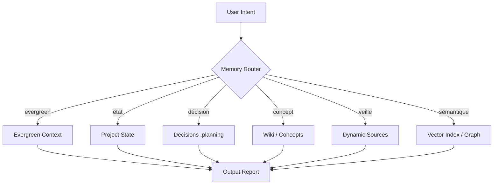

# 07 — Second Brain Routing Layer

> Couche **légère et déclarative** de routage mémoire. Elle ne stocke rien : elle décrit
> *quelle intention* doit aller vers *quelle source de contexte*, et *comment* cette source
> doit être traitée (stocker / résumer / pointer / ne pas stocker). Implémentée par
> `.tricorderkit/memory_router.yaml` + `.tricorderkit/context_sources.yaml`, et cadrée par
> [08_CONTEXT_POLICY](08_CONTEXT_POLICY.md).

## Philosophie : reverse-engineering des questions

Plutôt que de tout charger en mémoire « au cas où », on part de **l'intention de la question**
et on remonte à la *seule* source nécessaire. C'est l'inverse d'un dump de contexte : on route
vers la bonne mémoire au lieu d'inonder le modèle. Cela économise des tokens (cohérent avec
`token-optimizer`) et réduit le bruit.

## Evergreen vs Dynamic

| Famille | Définition | Exemples | Politique par défaut |
|---|---|---|---|
| **Evergreen** | Stable, fait autorité, relu souvent | décisions (DEC-NNN), concepts, profil | `store` |
| **Dynamic** | Volatil, daté, jamais source de vérité durable | état projet, veille, recherche web | `summarize` |

## Routage par intention

Le tableau complet vit dans `memory_router.yaml`. Principe : `intent → source → storage_policy`.
Exemples : « pourquoi ce choix ? » → `decisions_log` (evergreen, store) ; « les nouveautés ? »
→ `veille_buffer` (dynamic, summarize) ; « retrouve ce qu'on a dit » → `vector_index` (graphify).

## Carte mémoire

(La même carte, autonome, est dans `docs/diagrams/memory_map.mmd`.)

## Relation avec l'existant (non-duplication)

Cette couche **n'invente pas** de nouveau moteur ; elle déclare le routage que les modules
suivants exécutent déjà :

- **`memory-boot`** : charge le contexte vif au boot (hot cache, patterns d'erreurs).
- **`obsidian-agent-layer`** : synchro et lecture du vault Markdown.
- **`graphify`** : index vectoriel + graphe (recherche sémantique).
- **`.tricorderkit/vault_optimizer.config.json`** : efficacité de lecture (manifest-first, anti full-read).
- **`.planning/DECISIONS.md`** : journal des décisions (evergreen).
- **`skills/tk-grill`** : capture *active* d'une décision par interrogation (≠ routage).

Règles dures :
1. Ne pas dupliquer `CLAUDE.md`, `AGENTS.md`, `.planning`, `memory-boot`, `graphify`, `obsidian-agent-layer`.
2. Ne pas recopier d'arborescence brute `/context`, `/decisions`, `/wiki`, `/vector_index` : on **pointe** vers les modules propriétaires.
3. Le **contenu métier** ne transite que par référence (`pointer_only`) — jamais stocké dans le repo public (DEC-016 / R37).
